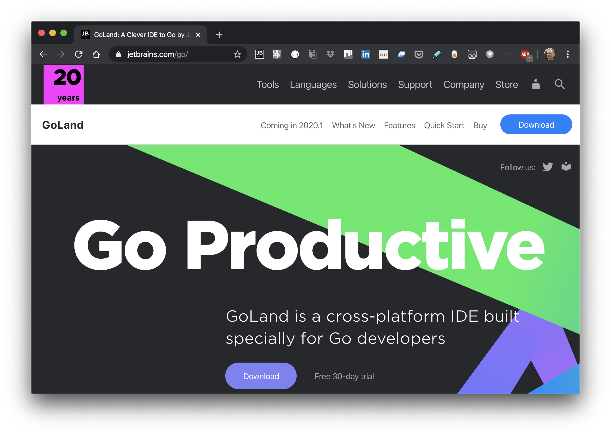
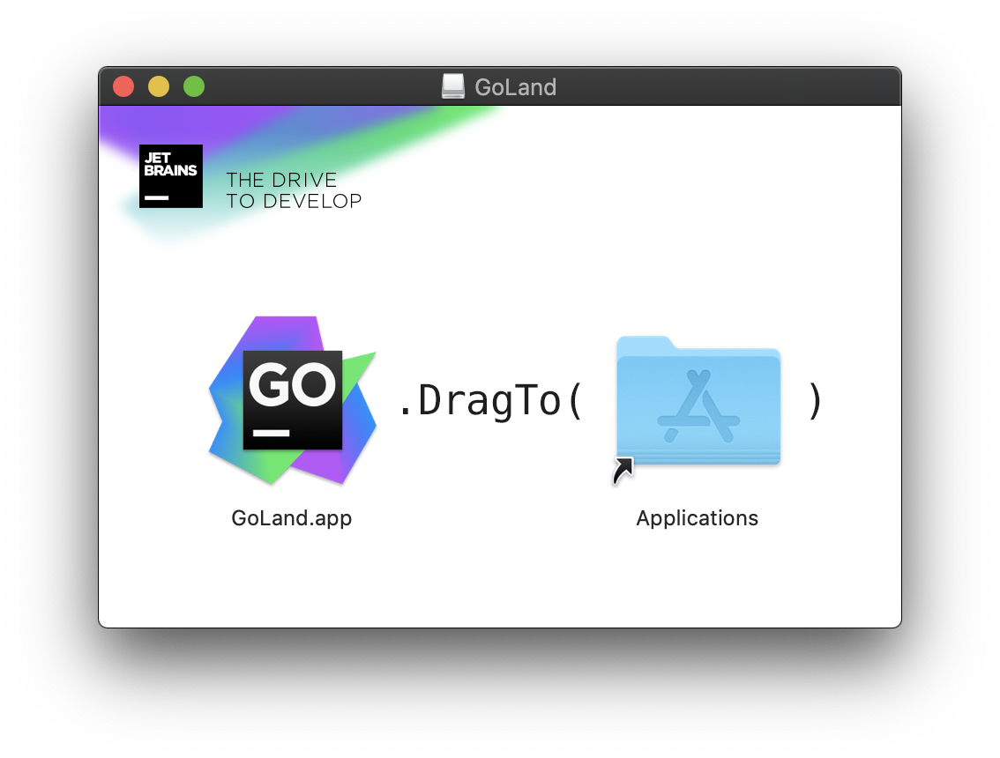
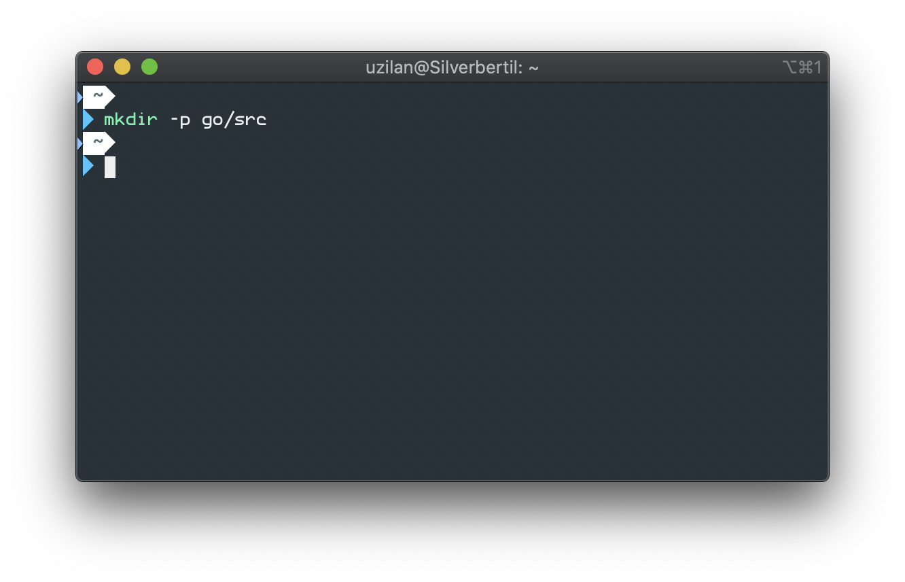
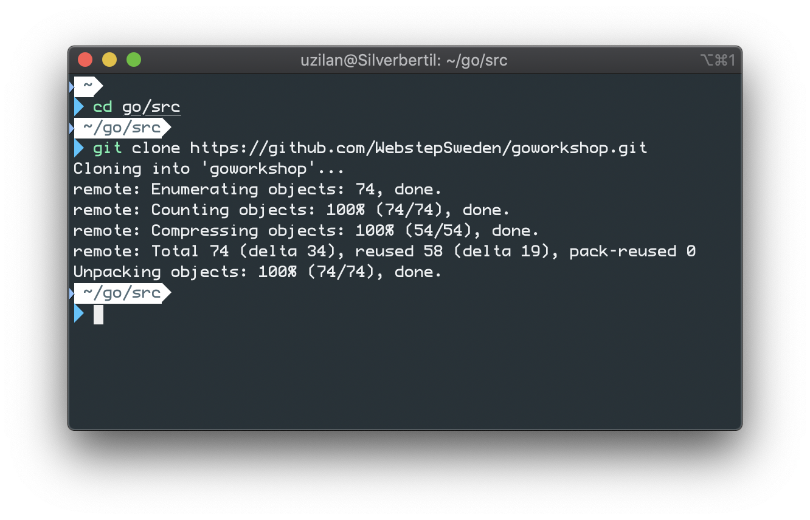
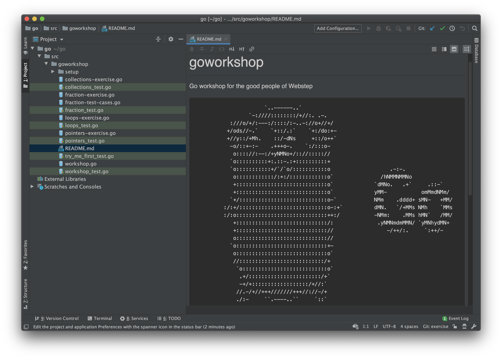
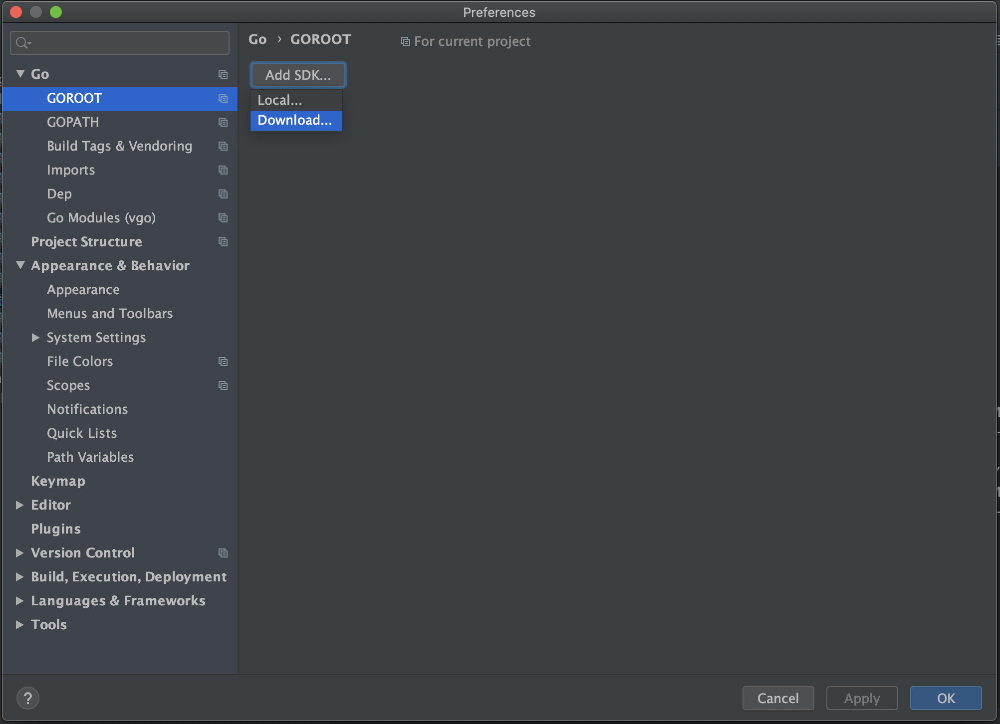
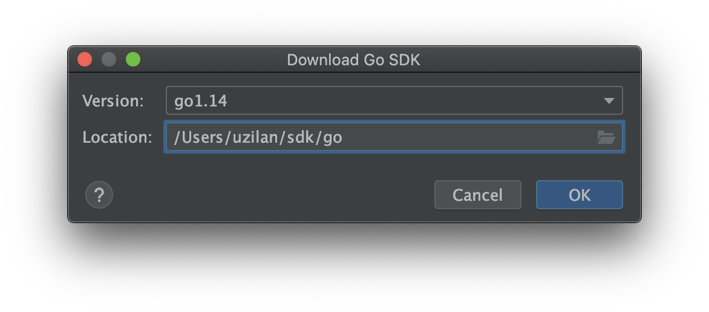
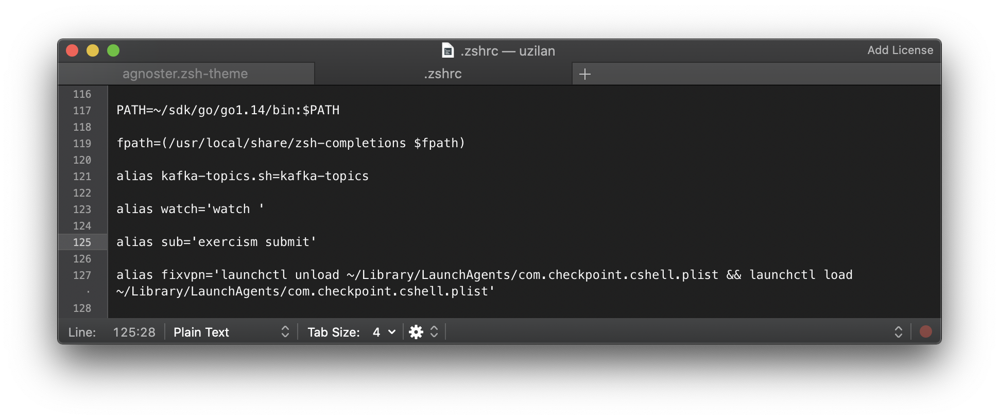
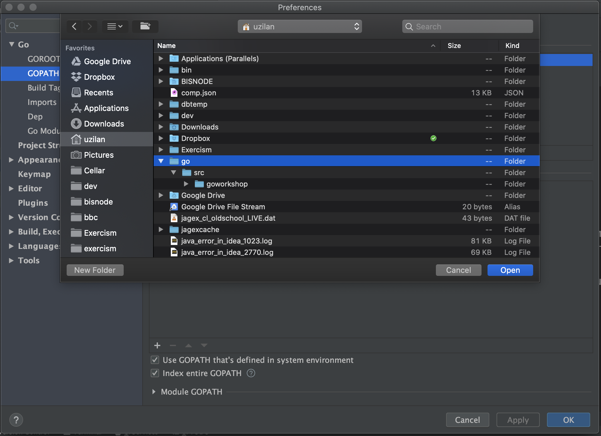
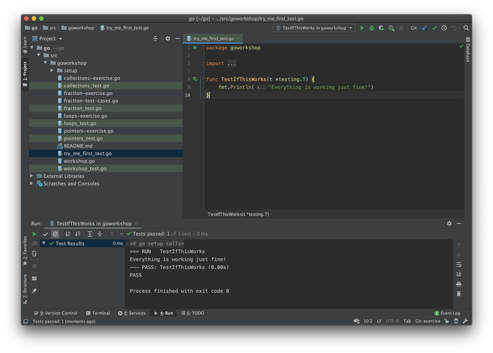

## Mac

1. Download GoLand from [https://www.jetbrains.com/go/](https://www.jetbrains.com/go/)

1. Once downloaded, install it

1. Create folders *~/go* and *~/go/src*

1. Clone the workshop repo from [https://github.com/WebstepSweden/goworkshop.git](https://github.com/WebstepSweden/goworkshop.git) into the *~/go/src* folder

1. Open the *~/go* folder with GoLand

1. Go to *GoLand* > *Preferences* > *Go* > *GOROOT* and choose *Add SDK...* > *Download...*

1. Select the latest version and click *Ok* (don't install it under *~/go* though, choose a different path)

1. Add the bin folder inside the downloaded sdk to your PATH environemt variable in *.bash_profile* or *.zshrc* file on your home directory

1. Back in GoLand, go to *GoLand* > *Preferences* > *Go* > *GOPATH* and add the *~/go* folder to the *Global GOPATH*

1. Open the *try_me_first_test.go* file and run the test by clicking the green arrow beside *func TestIfThisWorks...*. If everything works fine, you should see a confirmation in the run window

