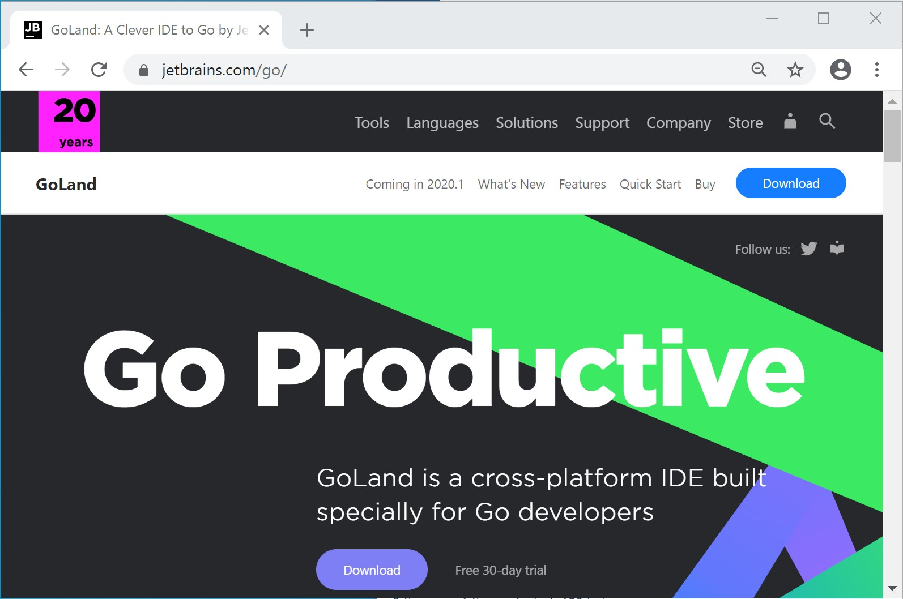
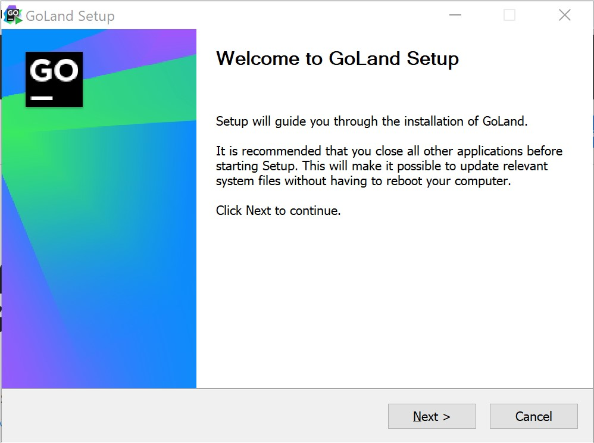
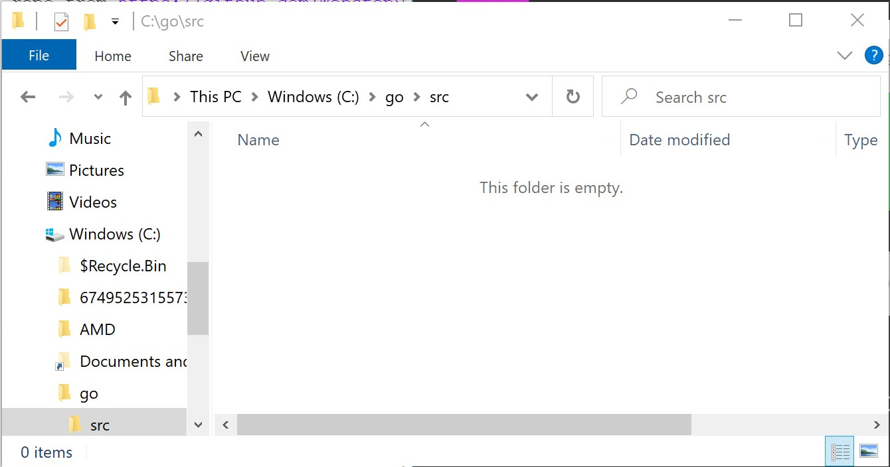
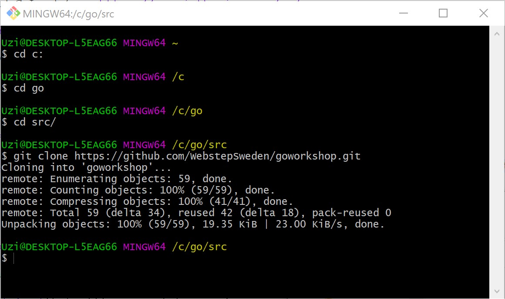
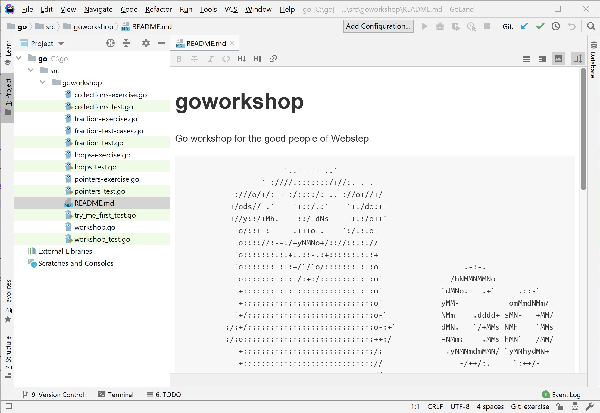
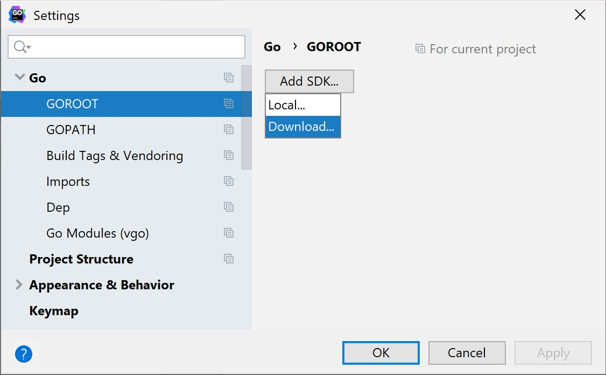
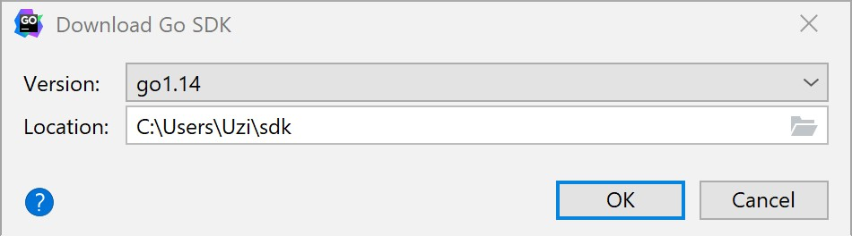
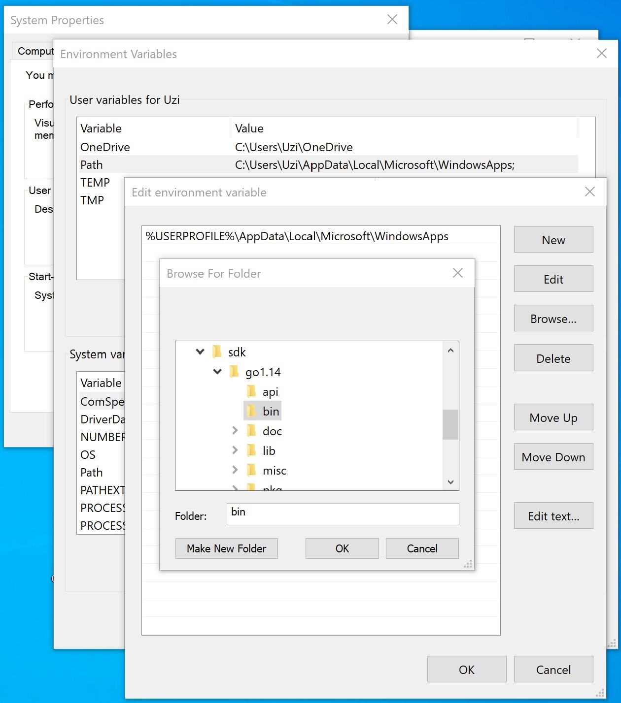
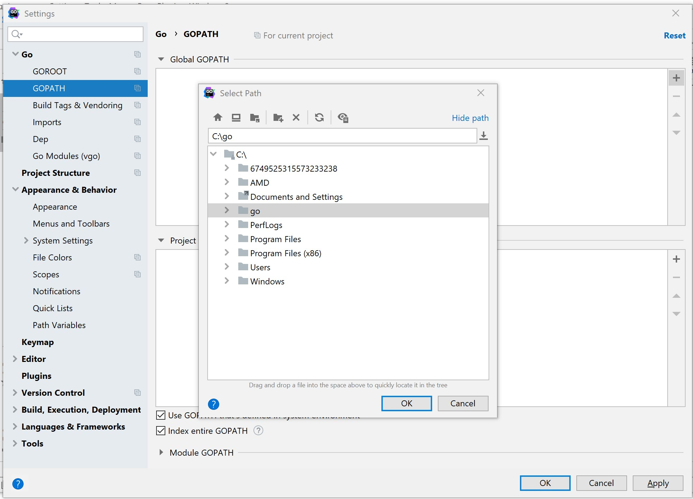
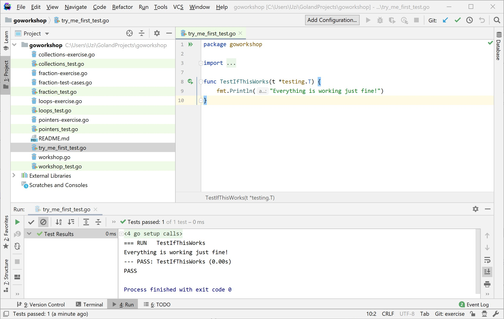

## Windows

1. Download GoLand from [https://www.jetbrains.com/go/](https://www.jetbrains.com/go/)

1. Once downloaded, install it

1. Create folders *C:\go* and *C:\go\src*

1. Clone the workshop repo from [https://github.com/WebstepSweden/goworkshop.git](https://www.jetbrains.com/go/) into the *C:\go\src* folder

1. Open the *C:\go* folder with GoLand

1. Go to *File* > *Settings* > *Go* > *GOROOT* and choose *Add SDK...* > *Download...*

1. Select the latest version and click *Ok*

1. Add the bin folder inside the downloaded sdk to your PATH environemt variable

1. Go to *File* > *Settings* > *Go* > *GOPATH* and add the *C:\go* folder to the *Global GOPATH*

1. Open the *try_me_first_test.go* file and run the test by clicking the green arrow beside *func TestIfThisWorks...*. If everything works fine, you should see a confirmation in the run window

